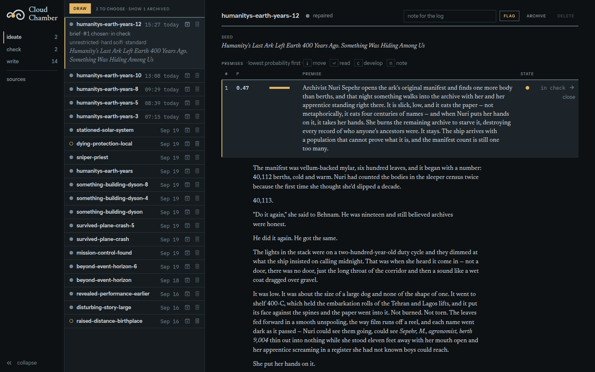
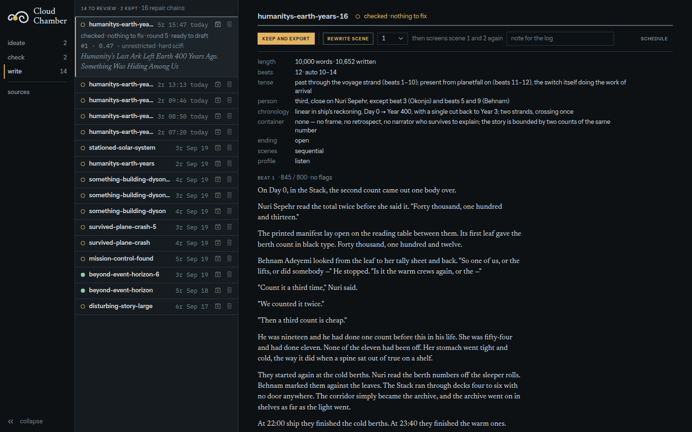

# Cloud Chamber

Cloud Chamber turns one sentence into a short story written to be heard.

A seed and six passages from published fiction become five premises. You pick
one. The pipeline derives an outline, two context vignettes and an ending,
checks that brief with independent checkers, repairs what they find, then
writes the story a beat at a time and screens every beat. It stops at three
gates, and a person decides at each one.

Every model call is a headless `claude -p`. Nothing is fine-tuned and no model
is served. The work is in the asks, the checkers and the record of what was
already judged.

## What it is measured against

The benchmark is the narrated science fiction and horror on YouTube: an hour
of story, read aloud, that people finish. A run is judged against a real
transcript from one of those channels.

The judging is blind and pairwise. Two unlabelled transcripts go to a judge as
Story One and Story Two. The judge answers eight questions a listener can
answer — the hook, whether the thing arrives in the flesh, whether the people
sound like people, feeling, cost, the ending, clarity by ear, momentum — and
then makes an overall call. The order swaps between passes. The panel is five
model families, none of them Claude: Gemini 3.1 Pro, GPT-5.1, Grok 4.3,
Kimi K2.5 and GLM-4.7, three passes each.

| run | code | overall | axis calls won or tied |
|---|---|---|---|
| [10](evals/20260920201308-3f55.md) | every beat placed in time | 15 of 15 | 110 of 120 |
| [11](evals/20260920224712-7797.md) | the trimmed pipeline | 15 of 15 | 111 of 120 |

No judge in thirty passes preferred the channel's story.

The limits are real: one seed, one source transcript, one story per run, and
judges that stand in for a listener rather than being one. The reports under
[`evals/`](evals/) record every run, the failures included.

## How a draw works

| Stage | What happens | Calls |
|---|---|---|
| extract | PDFs and SCP articles become scored passages, once | outside a draw |
| premises | the seed and six drawn passages become five premises, each with a stated probability | 1 |
| execute | each premise is written as a 400-word vignette | 5 |
| **gate 0** | **you read the five and choose one** | — |
| outline, context, ending | the chosen premise becomes a beat structure, two vignettes and an ending | 4 |
| check | five checkers read the brief, none seeing another's output; claims runs only under a setting | 1 or 2 a checker |
| repair | findings scoring 7 or more are answered; up to four rounds, and the loop stops when nothing reaches the floor | varies |
| **gate 1** | **you read the findings and pass the brief** | — |
| schedule | the brief becomes a beat sheet: words, job, time, what each beat withholds | 1 |
| scenes | one fresh call writes each beat, under the constraints the schedule names | 1 a beat |
| screens | every beat is screened against the ledger and against a list of structural tells; the joined draft goes through the slop and listen screens | 2 a beat |
| **gate 2** | **you read the draft with its flags and keep it or drop it** | — |

Run 11 took 57 calls to reach the brief, five repair rounds, and wrote twelve
beats and 10,566 words — about 75 minutes of narration.

## What makes it more than a long prompt

**Premises are sampled, not requested.** The model states a probability for
each premise it proposes, and the draw asks for a named band of that
distribution: `tail` is 0 to 0.1, `standard` is 0.35 to 1. The tail is the
default, so the pipeline returns the strangest defensible reading of a seed,
not the most conventional one.

**The checkers are adversarial and separate.** Five of them — derivation,
ledger, structure, resemblance, claims — run as their own sealed calls. A
finding survives only when two readings agree and a reader of the story would
notice it. Repair is a loop with a floor, and it converges or says it did not.

**Two screens use no model at all.** The slop screen counts lexicon hits,
not-X-but-Y constructions and repeated trigrams against the passage pool. The
listen screen measures sentence length, numerals, quotation and the body named
against transcripts of the real channels. They mark; they do not judge.

**Judgement is recorded once.** Every keep, pass and flag on a passage, a
theme or a brief goes to a verdict log and is replayed, so a regeneration
inherits what you already decided.

## Requirements

- [bun](https://bun.sh) 1.3 or later, for the pipeline, the API and the UI.
- The `claude` CLI on `PATH`. Every model call is a headless `claude -p`.
- Python 3.11 or later with `pdfplumber`, `pdfminer.six`, `numpy`,
  `sentence-transformers` and `biberplus`, for extraction and theme embeddings.

## The corpus

The corpus is not in this repository. The books it draws examples from, the
example bank extracted from them, the transcripts the runs are judged against
and the author's own stories are third-party or unpublished work, so they live
in a private repository. The pipeline expects that clone beside this one:

```sh
git clone <the private corpus repo> ~/cloudchamber-corpus
```

`sources/**/*.pdf`, `bank/examples/`, `evals/reference/`, `sources/settings/`
and `stories/` are symlinks into it, and `.gitignore` keeps them out. What is
here is the metadata: `sources/manifest.toml`, which names the thirty sources,
and the SCP articles, which are CC BY-SA. The store holds 619 stories and
4,082 scored passages once the corpus is in place.

## Quick start

```sh
bun install
./cloudchamber extract                     # read, segment and score the corpus into the store
./cloudchamber draw --genre horror         # five premises, then wait at gate 0
./cloudchamber gate <draw> choose <execute-step>
./cloudchamber gate <draw> auto            # check and repair until it converges
./cloudchamber draft <draw> --profile listen
./cloudchamber story <draw>                # the draft with its screen flags inline
```

Or drive the same actions from the UI:

```sh
bun run ui:build && ./cloudchamber serve   # http://127.0.0.1:3002
```

Four tabs: browse the corpus, ideate a draw, check a brief, write the story.
Three of them show a running operation and the judgement it is waiting for at
the same time.

The ideate tab: the draws on the left, and on the right the chosen premise
with the probability the model stated for it, above the vignette that executed
it.



The write tab: the form the schedule settled on, then each beat with its word
count and its screen flags.



`./cloudchamber help` prints every command and every tunable value, live.

## Layout

| Path | Holds |
|---|---|
| `app/cli/` | the `cloudchamber` command |
| `app/pipeline/` | draw, check, repair, draft and screens; prompts, tomls and the store |
| `app/server/` | the Fastify API the UI calls |
| `app/ui/` | the React UI: browse, ideate, check, write |
| `extract/` | the Python extractor: PDFs and SCP articles into passages and facets |
| `sources/` | `manifest.toml` and the SCP articles; the lore settings symlink in |
| `bank/` | the verdict and theme logs, and the eligible passages as Markdown |
| `briefs/` | one directory per finished draw |
| `docs/` | the knobs, the evaluation protocol and the specs |
| `evals/` | one report per evaluation run, and the judge |
| `research/` | literature reviews behind the pipeline's design |
| `~/.cloudchamber/` | the SQLite store; rebuilt from `sources/` and `bank/` |
| `~/cloudchamber-corpus/` | the private corpus this repo symlinks to |

## Docs

- [`docs/knobs.md`](docs/knobs.md): every tunable. Generated by
  `./cloudchamber help --md`; never edited by hand.
- [`docs/evaluation.md`](docs/evaluation.md): the protocol an evaluation run follows.
- [`docs/specs/`](docs/specs/): the design of record for each pipeline.
- [`PRODUCT.md`](PRODUCT.md) and [`DESIGN.md`](DESIGN.md): the product and the
  visual design the UI holds to.
- [`research/README.md`](research/README.md): what the published record supports.

## Tests

```sh
bun test app                         # the pipeline, the API and the store
bunx tsc --noEmit                    # types
python3 -m pytest -q extract/tests   # the extractor; needs the corpus PDFs
```

## License

[MIT](LICENSE). The code only. The corpus is not in this repository and is not
licensed by it: the books, the transcripts and the stories belong to their
authors.
